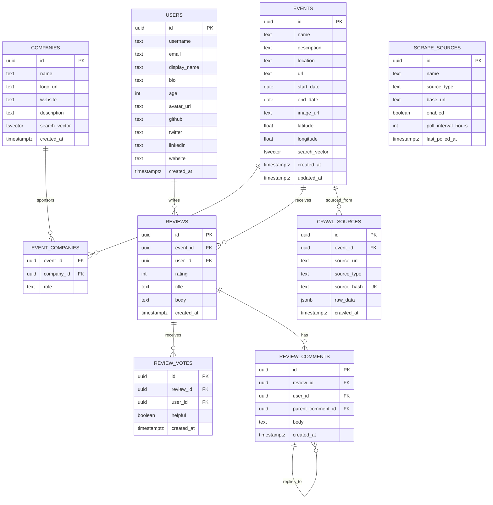

# RateMyHackathons

A platform for rating, reviewing, and discovering hackathon events. Search by **company**, **event**, or **user**.

## Tech Stack

| Layer | Technology | Rationale |
|---|---|---|
| Backend | Rust + [Actix Web](https://actix.rs/) | High-performance async REST API |
| Crawler | Python + [Scrapling](https://github.com/D4Vinci/Scrapling) | Adaptive scraping with proxy rotation & stealth |
| Analytics | Rust + Actix-Web + SvelteKit | Live dashboard with crawl stats, SSE feed |
| Database | PostgreSQL | Many-to-many relations, full-text search (`tsvector`), JSONB for crawler data |
| Query Layer | [SQLx](https://github.com/launchbadge/sqlx) | Async-native, compile-time checked SQL |
| IDs | UUIDv7 | Time-ordered for efficient B-tree indexing |
| Frontend | SvelteKit + Svelte 5 + Tailwind v4 + cobe globe + GSAP | Editorial brutalist B&W design, Instrument Serif + Space Mono, WebGL globe, GSAP scroll animations |

## Data Schema



## Documentation

| Component | README |
|---|---|
| **Backend API** | [backend/README.md](backend/README.md) |
| **Services** | [services/README.md](services/README.md) |
| **Crawler** | [services/crawler/README.md](services/crawler/README.md) |
| **Analytics** | [services/analytics/README.md](services/analytics/README.md) |
| **CV API Recon** | [services/crawler/cv/API_RECON.md](services/crawler/cv/API_RECON.md) |
| **Luma API Recon** | [services/crawler/luma/API_RECON.md](services/crawler/luma/API_RECON.md) |
| **MLH Recon** | [services/crawler/mlh/API_RECON.md](services/crawler/mlh/API_RECON.md) |
| **Hackiterate Recon** | [services/crawler/hackiterate/API_RECON.md](services/crawler/hackiterate/API_RECON.md) |

## Project Structure

```
ratemyhackathons/
├── frontend/              # SvelteKit frontend
│   ├── src/
│   │   ├── app.css       # Dark theme (Tailwind v4)
│   │   ├── lib/
│   │   │   ├── api.ts         # Typed API client
│   │   │   ├── types.ts       # TypeScript interfaces
│   │   │   ├── animations/gsap.ts  # ScrollTrigger actions
│   │   │   └── components/    # Globe, EventCard, ReviewCard, Nav, Footer
│   │   └── routes/
│   │       ├── +page.svelte   # Landing page (7 sections)
│   │       ├── about/         # About page (mission, stack, data sources)
│   │       ├── api/           # API documentation (interactive endpoint reference)
│   │       ├── events/        # Event list (sort/search/date-range filter/list-grid toggle) + detail
│   │       ├── companies/     # Company list (sort/search) + detail
│   │       ├── compare/       # Side-by-side comparison (inline search, entity chips, shareable URLs)
│   │       ├── users/[id]/    # User profiles
│   │       └── search/        # Tabbed search results
├── backend/               # Rust API server
│   ├── src/
│   │   ├── main.rs        # Server entry point + health check
│   │   ├── lib.rs         # Library crate (public modules for tests)
│   │   ├── config.rs      # Environment configuration
│   │   ├── db.rs          # Database pool setup
│   │   ├── errors.rs      # API error types
│   │   ├── models/        # Data models & DTOs
│   │   └── routes/        # API route handlers
│   ├── tests/             # Integration tests
│   └── migrations/        # PostgreSQL migrations
├── services/              # Standalone services
│   ├── crawler/           # Python event scraper
│   │   ├── main.py        # CLI: --once, --daemon, --dry-run
│   │   ├── dry_run.py     # Standalone spider test (no DB, all sources + dedup)
│   │   ├── db.py          # asyncpg database layer
│   │   ├── dedup.py       # Hash + fuzzy + cross-source URL deduplication
│   │   ├── proxy.py       # Proxy rotation setup
│   │   ├── company.py     # Best-effort company matching
│   │   ├── sponsors.py    # 4-strategy sponsor extraction
│   │   ├── llm.py         # OpenRouter LLM (free + paid fallback)
│   │   ├── spiders/       # Source-specific scrapers
│   │   │   ├── mlh.py             # MLH (HTML scraping)
│   │   │   ├── hackiterate.py     # Hackiterate (Playwright)
│   │   │   ├── cerebralvalley.py  # CV public API + host enrichment
│   │   │   └── luma.py            # Luma API (15-city geo sweep + keyword filter)
│   │   ├── cv/            # CV API recon
│   │   │   └── API_RECON.md
│   │   ├── luma/          # Luma API recon
│   │   │   └── API_RECON.md
│   │   ├── mlh/           # MLH scraping recon
│   │   │   └── API_RECON.md
│   │   └── hackiterate/   # Hackiterate scraping recon
│   │       └── API_RECON.md
│   └── analytics/         # Rust analytics API + SvelteKit admin dashboard
│       ├── src/            # Actix-web server (:8081)
│       │   ├── main.rs
│       │   ├── db.rs       # Analytics queries
│       │   └── routes/     # crawl, events, reviews, live SSE
│       └── dashboard/     # SvelteKit + Tailwind v4 admin dashboard
│           └── src/routes/ # overview, events, crawl, reviews pages
├── CHANGELOG.md
└── .env.example
```

## Getting Started

### Prerequisites

- [Rust](https://rustup.rs/) (stable, 1.85+ for edition 2024)
- [PostgreSQL](https://www.postgresql.org/) 17
- [Python](https://python.org/) 3.11+ with [uv](https://github.com/astral-sh/uv) (for crawler)
- [Bun](https://bun.sh/) (for analytics dashboard)

### Setup

```bash
# 1. Clone and enter project
git clone <repo-url>
cd ratemyhackathons

# 2. Create the database
createdb ratemyhackathons

# 3. Configure environment
cp backend/.env.example backend/.env
# Edit backend/.env with your database credentials

# 4. Run the migrations
psql -d ratemyhackathons -f backend/migrations/20260313_initial_schema.sql
psql -d ratemyhackathons -f backend/migrations/20260313_review_votes_comments.sql
psql -d ratemyhackathons -f backend/migrations/20260313_user_profiles_event_slugs.sql
psql -d ratemyhackathons -f backend/migrations/20260313_crawl_registry.sql
psql -d ratemyhackathons -f backend/migrations/20260314_event_geocoding.sql
psql -d ratemyhackathons -f backend/migrations/20260314_rmp_ratings.sql

# 5. Start the server
cd backend
cargo run

# 6. (Optional) Run the crawler
cd ../services/crawler
pip install -r requirements.txt  # or: pip install scrapling asyncpg python-dotenv
cp .env.example .env   # add your DATABASE_URL and PROXY_URL
python main.py --dry-run   # preview without inserting
python main.py --once      # single crawl pass
python main.py --daemon    # continuous polling

# 7. (Optional) Run the analytics dashboard
cd ../analytics
cargo run                  # API on :8081
cd dashboard && bun install && bun dev   # dashboard on :5174
```

The API will be available at `http://127.0.0.1:8080`.
The frontend will be at `http://localhost:5173`.
The analytics dashboard will be at `http://localhost:5174`.

### Frontend

```bash
cd frontend
bun install
bun dev                    # Dev server on :5173 (proxies /api → :8080)
bun run build              # Production build
bun run check              # TypeScript/Svelte type checking
```

## API Endpoints & Schemas

### Overview

| Method | Path | Description |
|---|---|---|
| `GET` | `/health` | Health check (DB connectivity + version) |
| `GET` | `/api/events` | List events (paginated, filterable) |
| `GET` | `/api/events/{id}` | Event detail with companies & reviews |
| `POST` | `/api/events` | Create event |
| `GET` | `/api/events/globe` | Globe markers (events with lat/lng) |
| `GET` | `/api/events/locations` | Unique location strings (for autocomplete) |
| `GET` | `/api/companies` | List companies (paginated) |
| `GET` | `/api/companies/{id}` | Company detail with events |
| `POST` | `/api/companies` | Create company |
| `GET` | `/api/users` | List users (paginated) |
| `GET` | `/api/users/{id}` | User detail with reviews |
| `POST` | `/api/users` | Create user |
| `POST` | `/api/users/{id}/reviews` | Create review (10 category scores, auth required) |
| `GET` | `/api/reviews/{id}` | Review detail with votes & threaded comments |
| `POST` | `/api/reviews/{id}/vote` | Vote helpful/unhelpful (upsert) |
| `POST` | `/api/reviews/{id}/comments` | Add comment or reply |
| `GET` | `/api/reviews/{id}/comments` | Get threaded comment tree |
| `GET` | `/api/search?q=&type=` | Full-text search |
| `GET` | `/api/tags` | List all tags |
| `GET` | `/api/tags/top?entity_type=&entity_id=` | Top 5 tags for entity |
| `POST` | `/api/tags` | Create tag (returns existing if name matches) |
| `GET` | `/api/compare?type=&ids=` | Side-by-side entity comparison |

---

### Events

#### `GET /api/events`

Query params: `?page=1&per_page=20&company_id=uuid`

```json
// Response 200:
{
  "data": [{
    "id": "uuid", "name": "HackMIT 2025", "description": "...",
    "location": "Cambridge, MA", "url": "https://...",
    "start_date": "2025-10-01", "end_date": "2025-10-02",
    "image_url": "https://...",
    "companies": [{ "id": "uuid", "name": "Google", "role": "sponsor" }],
    "avg_rating": 4.2, "review_count": 15,
    "created_at": "2025-01-01T00:00:00Z"
  }],
  "total": 100, "page": 1, "per_page": 20
}
```

#### `GET /api/events/{id}`

```json
// Response 200:
{
  "id": "uuid", "name": "HackMIT 2025", "description": "...",
  "location": "Cambridge, MA", "url": "https://...",
  "start_date": "2025-10-01", "end_date": "2025-10-02",
  "image_url": "https://...",
  "companies": [{ "id": "uuid", "name": "Google", "role": "sponsor" }],
  "reviews": [{
    "id": "uuid", "user_id": "uuid", "username": "alice",
    "rating": 5, "title": "Amazing!", "body": "...", "created_at": "..."
  }],
  "avg_rating": 4.2, "review_count": 15
}
```

#### `POST /api/events`

```json
// Request:
{
  "name": "HackMIT 2025",          // required
  "description": "Annual hackathon", // optional
  "location": "Cambridge, MA",       // optional
  "url": "https://hackmit.org",      // optional
  "start_date": "2025-10-01",        // optional
  "end_date": "2025-10-02",          // optional
  "image_url": "https://...",        // optional
  "company_ids": ["uuid", "uuid"]    // optional, attach companies
}
// Response 201: full event object
```

---

### Companies

#### `GET /api/companies`

Query params: `?page=1&per_page=20&search=google`

```json
// Response 200:
{
  "data": [{
    "id": "uuid", "name": "Google", "logo_url": "https://...",
    "website": "https://google.com", "description": "...",
    "event_count": 12, "avg_rating": 4.1, "review_count": 23,
    "latest_event_date": "2025-10-01",
    "category_ratings": [
      { "category": "organization", "avg": 4.5 },
      { "category": "vibes", "avg": 4.2 }
    ],
    "created_at": "..."
  }],
  "total": 50, "page": 1, "per_page": 20
}
```

#### `GET /api/companies/{id}`

```json
// Response 200:
{
  "id": "uuid", "name": "Google", "logo_url": "...",
  "website": "https://google.com", "description": "...",
  "events": [{
    "id": "uuid", "name": "HackMIT 2025", "role": "sponsor",
    "start_date": "2025-10-01", "avg_rating": 4.2
  }]
}
```

#### `POST /api/companies`

```json
// Request:
{ "name": "Google", "logo_url": "...", "website": "...", "description": "..." }
// Response 201: full company object
```

---

### Users

#### `GET /api/users`

Query params: `?page=1&per_page=20`

```json
// Response 200:
{
  "data": [{
    "id": "uuid", "username": "alice", "display_name": "Alice Chen",
    "avatar_url": "...", "review_count": 5, "created_at": "..."
  }],
  "total": 200, "page": 1, "per_page": 20
}
```

#### `GET /api/users/{id}` — Full profile

```json
// Response 200:
{
  "id": "uuid", "username": "alice", "email": "alice@...",
  "display_name": "Alice Chen", "bio": "Full-stack developer",
  "age": 22, "avatar_url": "...",
  "socials": {
    "github": "alicechen",
    "twitter": "alice_dev",
    "linkedin": "alice-chen",
    "website": "https://alice.dev"
  },
  "reviews": [{
    "id": "uuid", "event_id": "uuid", "event_name": "HackMIT 2025",
    "rating": 5, "title": "Amazing!", "body": "...", "created_at": "..."
  }]
}
```

#### `POST /api/users`

```json
// Request:
{
  "username": "alice",              // required
  "email": "alice@example.com",      // required
  "display_name": "Alice Chen",      // optional
  "bio": "Full-stack developer",     // optional
  "age": 22,                         // optional, 13-150
  "avatar_url": "https://...",       // optional
  "github": "alicechen",             // optional
  "twitter": "alice_dev",            // optional
  "linkedin": "alice-chen",          // optional
  "website": "https://alice.dev"     // optional
}
// Response 201: full user object
```

---

### Reviews

#### `POST /api/users/{user_id}/reviews` — Create review

Requires authentication (Clerk JWT) in production. In dev mode, `user_id` in body is used.

```json
// Request:
{
  "event_id": "uuid",              // XOR with company_id
  "company_id": "uuid",           // XOR with event_id
  "title": "Amazing!",            // optional, max 200 chars
  "body": "Detailed review...",   // required, 350-5000 chars
  "would_return": true,           // optional
  "category_ratings": {           // required, all 10 categories
    "organization": 5,
    "prizes": 4,
    "mentorship": 5,
    "judging": 4,
    "venue": 3,
    "food": 4,
    "swag": 3,
    "networking": 5,
    "communication": 4,
    "vibes": 5
  },
  "tag_ids": ["uuid1", "uuid2"]   // optional
}
// Response 201: full review object with computed overall rating
```

#### `GET /api/reviews/{id}` — Review detail with votes & comments

```json
// Response 200:
{
  "id": "uuid", "event_id": "uuid", "user_id": "uuid",
  "rating": 5, "title": "Amazing!", "body": "...",
  "created_at": "...",
  "votes": { "helpful": 12, "unhelpful": 3 },
  "comments": [
    {
      "id": "uuid", "user_id": "uuid", "username": "bob",
      "body": "Great review!", "created_at": "...",
      "replies": [
        {
          "id": "uuid", "user_id": "uuid", "username": "alice",
          "body": "Thanks!", "created_at": "...",
          "replies": []
        }
      ]
    }
  ]
}
```

#### `POST /api/reviews/{id}/vote` — Vote helpful/unhelpful

One vote per user per review. Re-voting updates the existing vote (upsert).

```json
// Request:
{ "user_id": "uuid", "helpful": true }
// Response 200: { "id": "uuid", "review_id": "uuid", "user_id": "uuid", "helpful": true, "created_at": "..." }
```

#### `POST /api/reviews/{id}/comments` — Add comment or reply

Pass `parent_comment_id` to reply to an existing comment (Reddit-style nesting). Omit for a top-level comment.

```json
// Request (top-level comment):
{ "user_id": "uuid", "body": "Great review!" }

// Request (reply to another comment):
{ "user_id": "uuid", "parent_comment_id": "uuid", "body": "I agree!" }

// Response 201: full comment object
```

#### `GET /api/reviews/{id}/comments` — Get threaded comment tree

Returns nested JSON tree — each comment has a `replies` array containing its children, recursively.

```json
// Response 200:
[
  {
    "id": "uuid", "user_id": "uuid", "username": "bob",
    "body": "Great review!", "created_at": "...",
    "replies": [
      {
        "id": "uuid", "user_id": "uuid", "username": "alice",
        "body": "Thanks!", "created_at": "...",
        "replies": []
      }
    ]
  }
]
```

### Search

#### `GET /api/search`

Query params: `?q=hackathon&type=event|company|user&per_page=20`

```json
// Response 200:
{
  "events": [{ "id": "uuid", "name": "HackMIT", "rank": 0.95 }],
  "companies": [{ "id": "uuid", "name": "Google", "rank": 0.87 }],
  "users": [{ "id": "uuid", "name": "hackfan", "rank": 0.72 }],
  "total": 25
}
```

## Architecture: How Queries Work

All list endpoints use **correlated subqueries** instead of the N+1 pattern. Here's what that means:

### Example (from `list_companies`)

```sql
SELECT c.id, c.name, c.logo_url, c.website, c.description,
       (SELECT COUNT(*) FROM event_companies WHERE company_id = c.id) as event_count,
       (SELECT AVG(rating)::float8 FROM reviews WHERE company_id = c.id) as avg_rating,
       (SELECT COUNT(*) FROM reviews WHERE company_id = c.id) as review_count,
       c.created_at
FROM companies c
ORDER BY c.name ASC
LIMIT $1 OFFSET $2
```

**Line by line:**

- `FROM companies c` — Read the companies table (aliased as `c`)
- `SELECT c.id, c.name, ...` — Pick which columns to return
- `(SELECT COUNT(*) ...)` — **Subquery**: while on each company row, peek into `event_companies` and count matching rows. This runs *inside* the main query, not as a separate call
- `(SELECT AVG(rating) ...)` — Another subquery: compute average rating from reviews for this company
- `ORDER BY c.name ASC` — Sort A→Z
- `LIMIT $1 OFFSET $2` — Pagination (`$1` = page size, `$2` = how many rows to skip)

### Why Not Loop? (N+1 Problem)

| | Subquery (our approach) | N+1 loop |
|---|---|---|
| 3 companies | **1 query** | 4 queries |
| 20 companies | **1 query** | 21 queries |
| 100 companies | **1 query** | 101 queries |

Each query has network overhead (Rust → PostgreSQL → Rust), so the subquery approach is dramatically faster.

## Testing

```bash
cd backend
cargo test
```

45 tests across 5 files covering error handling, pagination, model serialization, route existence, and UUIDv7 ordering.

## Data Population

Data is populated via:
1. **Web crawler** — 4 spiders (MLH, Hackiterate, Cerebral Valley, Luma) with `--dry-run` preview mode
2. **Manual entry** through the API

## License

See [LICENSE](LICENSE) for details.