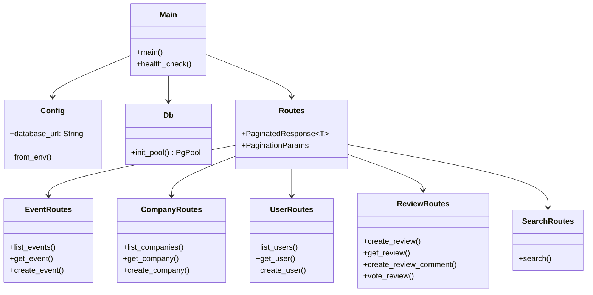
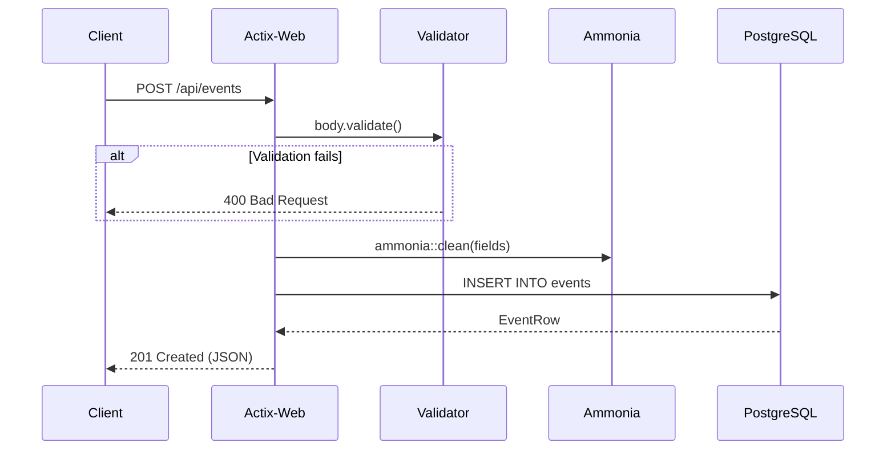

# Backend API

REST API server for RateMyHackathons — handles events, companies, users, reviews, and search.

## Architecture



## Request Flow



## Stack

| Crate | Purpose |
|---|---|
| `actix-web` | HTTP server |
| `sqlx` | Async Postgres queries |
| `validator` | Declarative input validation |
| `ammonia` | HTML sanitization (XSS prevention) |
| `uuid` | UUIDv7 generation |
| `chrono` | Timestamps |

## Running

```bash
cp .env.example .env   # set DATABASE_URL
psql -d ratemyhackathons -f migrations/20260313_initial_schema.sql
psql -d ratemyhackathons -f migrations/20260313_review_votes_comments.sql
psql -d ratemyhackathons -f migrations/20260313_user_profiles_event_slugs.sql
psql -d ratemyhackathons -f migrations/20260313_crawl_registry.sql
cargo run   # http://127.0.0.1:8080
cargo test  # 45 tests
```

## Endpoints

| Method | Path | Description |
|---|---|---|
| `GET` | `/health` | Health check |
| `GET/POST` | `/api/events` | List / create events |
| `GET` | `/api/events/{id}` | Event detail + companies + reviews |
| `GET/POST` | `/api/companies` | List / create companies |
| `GET` | `/api/companies/{id}` | Company detail + events |
| `GET/POST` | `/api/users` | List / create users |
| `GET` | `/api/users/{id}` | User detail + reviews |
| `POST` | `/api/reviews` | Create review |
| `GET` | `/api/reviews/{id}` | Review + votes + threaded comments |
| `POST` | `/api/reviews/{id}/vote` | Vote helpful/unhelpful |
| `POST` | `/api/reviews/{id}/comments` | Add comment (threaded) |
| `GET` | `/api/search?q=` | Full-text search |
