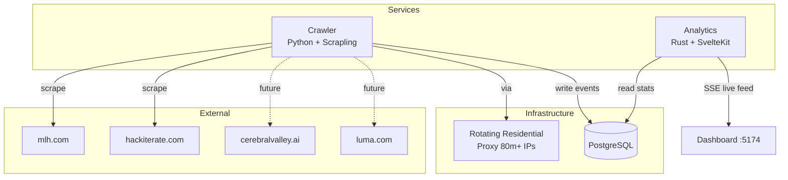

# Services

Standalone services that complement the main backend API. Each runs independently and shares the same PostgreSQL database.

## Overview



## Services

| Service | Language | Port | Description |
|---|---|---|---|
| [`crawler/`](crawler/) | Python | CLI | Scrapes hackathon listings from MLH, Hackiterate, etc. |
| [`analytics/`](analytics/) | Rust + Svelte | `:8081` / `:5174` | Live analytics dashboard with crawl stats |

## Running All Services

```bash
# Terminal 1 — Main API
cd ../backend && cargo run                    # :8080

# Terminal 2 — Crawler (one-shot)
cd crawler && python main.py --once

# Terminal 3 — Analytics API
cd analytics && cargo run                     # :8081

# Terminal 4 — Analytics Dashboard
cd analytics/dashboard && bun dev             # :5174
```
