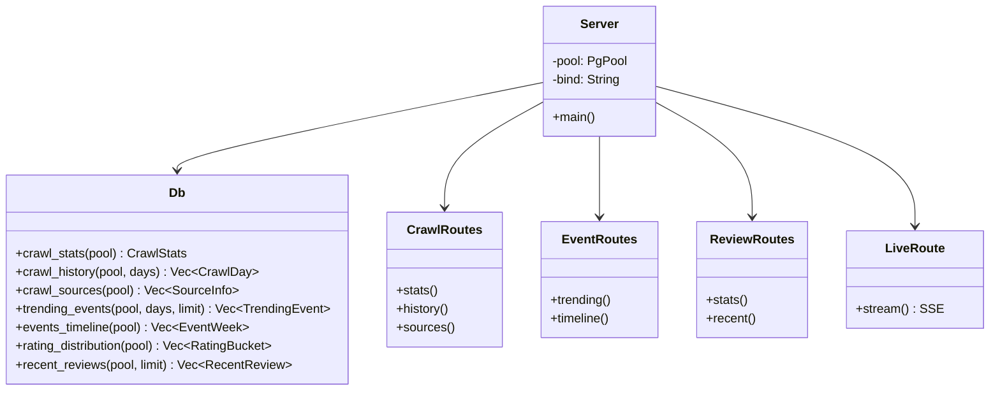
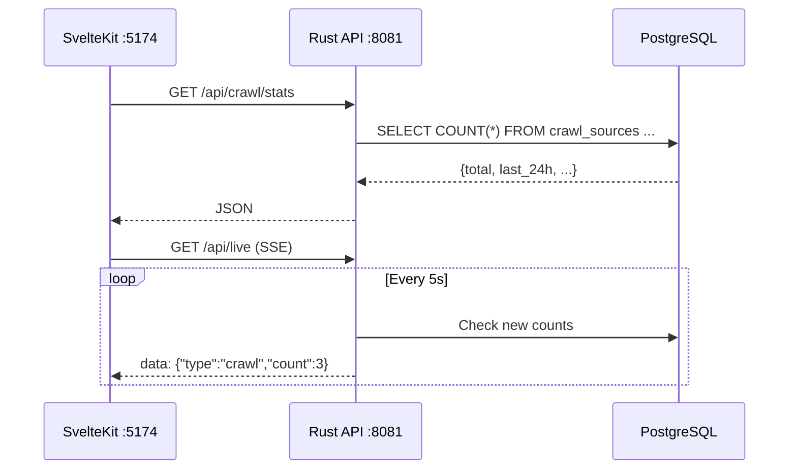
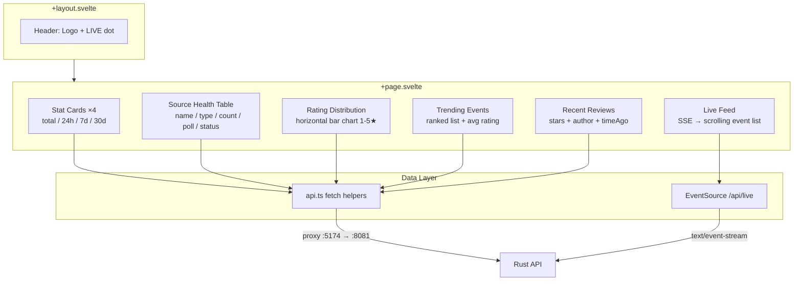

# Analytics

Rust API + SvelteKit dashboard for monitoring crawl activity, event trends, and review analytics.

## Architecture



## Data Flow



## API Endpoints

| Method | Path | Description |
|---|---|---|
| `GET` | `/api/crawl/stats` | Total scraped, 24h/7d/30d breakdown |
| `GET` | `/api/crawl/history?days=30` | Crawls per day time-series |
| `GET` | `/api/crawl/sources` | Source registry + poll status |
| `GET` | `/api/events/trending?days=30` | Most reviewed events |
| `GET` | `/api/events/timeline` | Events per week/month |
| `GET` | `/api/reviews/stats` | Rating distribution (1-5) |
| `GET` | `/api/reviews/recent?limit=10` | Latest reviews feed |
| `GET` | `/api/live` | SSE real-time event stream |

## Dashboard

SvelteKit app with Tailwind v4 and LayerChart.

| Panel | Description |
|---|---|
| Stat Cards | Total scraped, last 24h/7d/30d |
| Source Health | Table with poll status, event counts, enable dots |
| Live Feed | SSE-powered scrolling feed of new events + reviews |
| Rating Distribution | Horizontal bar chart (1-5 stars) |
| Trending Events | Ranked list with review counts + avg rating |
| Recent Reviews | Latest reviews with star rating + author |



## Running

```bash
# API server
cargo run   # http://127.0.0.1:8081

# Dashboard (separate terminal)
cd dashboard
bun install
bun dev     # http://localhost:5174
```

## Stack

| Layer | Tech |
|---|---|
| API | Rust + Actix-Web |
| Dashboard | SvelteKit + Tailwind v4 |
| Charts | LayerChart (Svelte-native D3) |
| Real-time | Server-Sent Events (SSE) |
