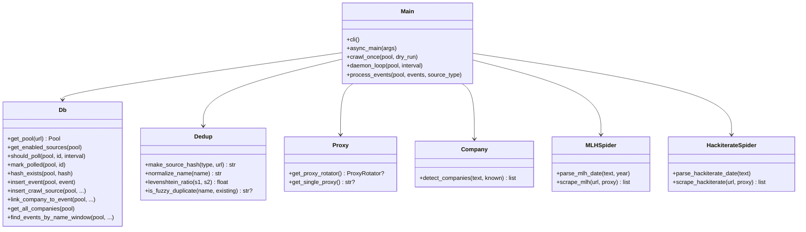
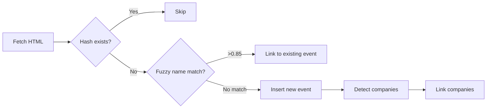
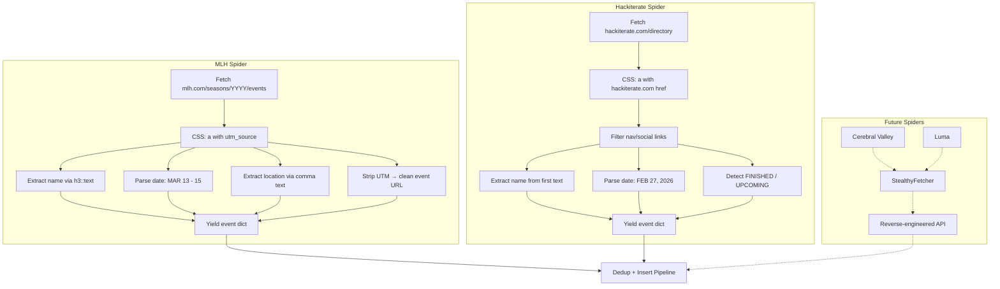

# Crawler

Python scraping service that continuously polls hackathon sources, deduplicates against existing events, and auto-detects sponsoring companies.

## Architecture



## Crawl Pipeline



## Spider Architecture



## Usage

```bash
# Setup
uv venv && uv pip install -r requirements.txt
cp .env.example .env   # set DATABASE_URL, PROXY_URL

# Run
python main.py --dry-run     # preview without inserting
python main.py --once        # single crawl pass
python main.py --daemon      # continuous polling (default: 1h)
python main.py --daemon --interval 7200   # poll every 2h
```

## Sources

| Source | Type | Status |
|---|---|---|
| `mlh.com/seasons/{YYYY}/events` | Server-rendered | ✅ Ready |
| `hackiterate.com/directory` | Server-rendered | ✅ Ready |
| `cerebralvalley.ai` | SPA (Next.js) | 🔜 Needs API reverse-engineering |
| `luma.com` | SPA | 🔜 Needs API reverse-engineering |

New sources can be added dynamically via the `scrape_sources` table.

## Environment

| Variable | Description |
|---|---|
| `DATABASE_URL` | PostgreSQL connection string |
| `PROXY_URL` | Rotating residential proxy (single or comma-separated) |
