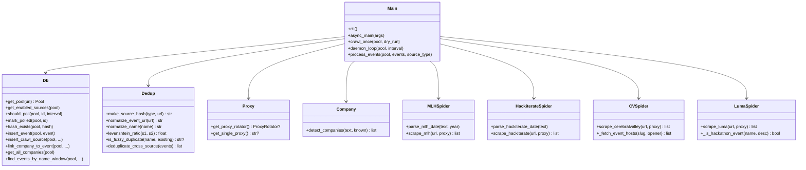
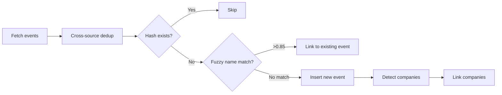
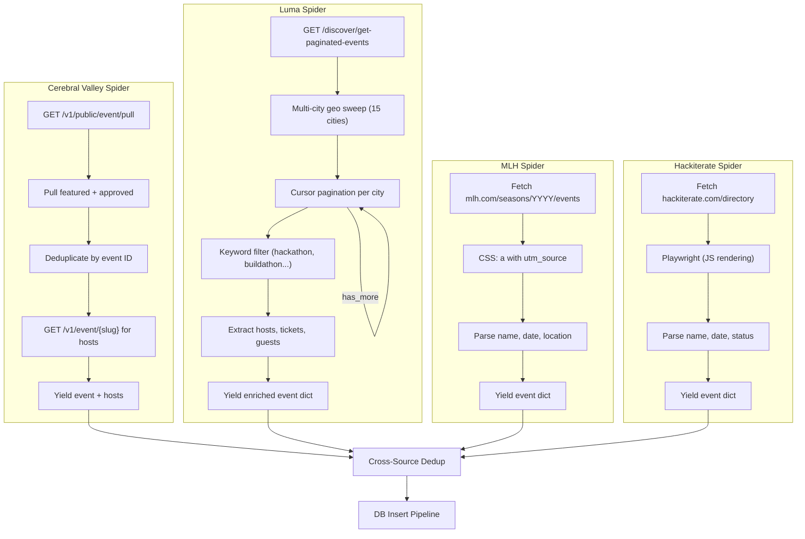

# Crawler

Python scraping service that polls hackathon sources, deduplicates across platforms, enriches with host/organizer data, and auto-detects sponsoring companies.

## Architecture



## Crawl Pipeline



## Cross-Source Deduplication

67% of CV events link to lu.ma/luma.com — same events appear in both spiders. The dedup layer:

1. **URL normalization** — strips UTM/tracking params, normalizes `luma.com` → `lu.ma`
2. **Cross-source grouping** — events with same canonical URL get grouped
3. **Smart merging** — keeps richest record (Luma priority), merges hosts from all sources

```
Before: 9,273 events (CV: 9,258 + Luma: 15)
After:  8,976 unique (187 duplicates merged)
```

## Spider Architecture



## Enriched Data Per Source

| Field | Luma | CV | MLH | Hackiterate |
|---|---|---|---|---|
| Name | ✅ | ✅ | ✅ | ✅ |
| Dates | ✅ | ✅ | ✅ | ✅ start only |
| Location | ✅ | ✅ | ✅ | ✅ |
| Description | ✅ | ✅ | ❌ | ❌ |
| Image | ✅ | ✅ | ❌ | ❌ |
| **Hosts/Organizers** | ✅ (name, twitter, linkedin, website) | ✅ (name, isOrg, twitter, github) | ❌ | ❌ |
| **Guest count** | ✅ | ❌ | ❌ | ❌ |
| **Ticket info** | ✅ (free/paid, spots, sold out) | ❌ | ❌ | ❌ |
| **Timezone** | ✅ | ❌ | ❌ | ❌ |
| Event type | ❌ | ✅ (HACKATHON) | ❌ | ❌ |

### Sponsor Extraction

Each event page is visited to extract sponsor/partner names using 4 strategies:

| Strategy | Method | Coverage |
|---|---|---|
| CSS class/id | `[class*='sponsor']`, `[id*='partner']` → img alt text | ~40% |
| Heading detection | `<h2>Sponsors</h2>` → parent container imgs | ~20% |
| Src path matching | `` | ~10% |
| **LLM fallback** | Page text → OpenRouter (free models + paid Gemini Flash) | ~30% |

## Usage

```bash
# Setup
uv venv && uv pip install -r requirements.txt
cp .env.example .env   # set DATABASE_URL, PROXY_URL

# Dry-run (no DB needed)
python dry_run.py              # all sources with cross-source dedup
python dry_run.py cv           # Cerebral Valley only
python dry_run.py luma         # Luma only
python dry_run.py mlh          # MLH only
python dry_run.py hackiterate  # Hackiterate only
python dry_run.py cv luma      # specific sources with dedup

# Production (requires DB)
python main.py --dry-run     # preview without inserting
python main.py --once        # single crawl pass
python main.py --daemon      # continuous polling (default: 1h)
python main.py --daemon --interval 7200   # poll every 2h
```

## Sources

| Source | Type | Status | Dry-run count |
|---|---|---|---|
| `mlh.com/seasons/{YYYY}/events` | Server-rendered HTML | ✅ Ready | 194 |
| `hackiterate.com/directory` | JS-rendered (Playwright) | ✅ Ready | 6 |
| `cerebralvalley.ai` | Public JSON API (no auth) | ✅ Ready | 9,258 |
| `lu.ma` | Public JSON API (15-city geo sweep) | ✅ Ready | 15 hackathon events |

After cross-source dedup: **~8,976 unique events**.

New sources can be added dynamically via the `scrape_sources` table.

## API Recon Docs

| Platform | Path |
|---|---|
| Cerebral Valley | [cv/API_RECON.md](cv/API_RECON.md) |
| Lu.ma | [luma/API_RECON.md](luma/API_RECON.md) |
| MLH | [mlh/API_RECON.md](mlh/API_RECON.md) |
| Hackiterate | [hackiterate/API_RECON.md](hackiterate/API_RECON.md) |

## Environment

| Variable | Description |
|---|---|
| `DATABASE_URL` | PostgreSQL connection string |
| `PROXY_URL` | Rotating residential proxy (single or comma-separated) |
| `OPENROUTER_API_KEY` | For LLM-based sponsor extraction fallback |
